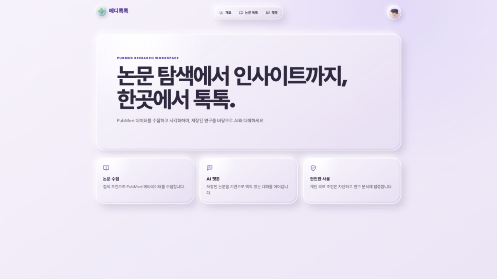
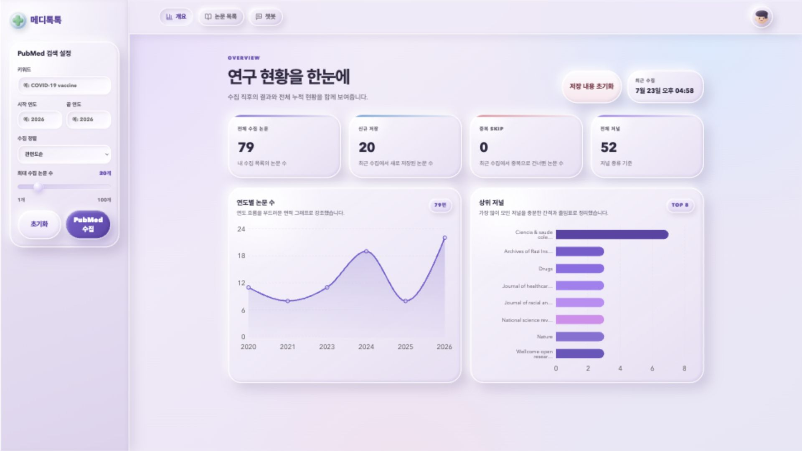
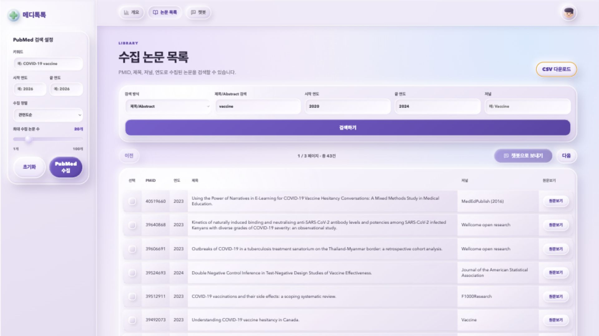
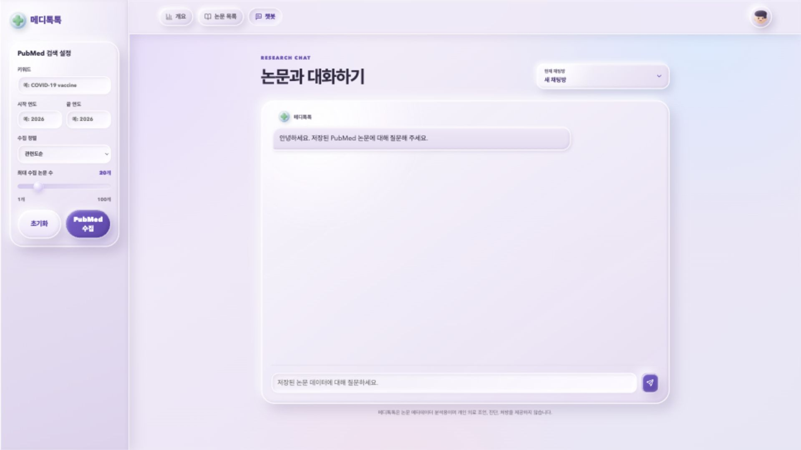
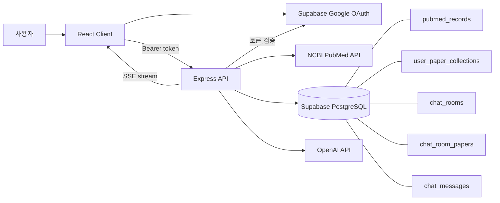

<div align="center">
  

# 메디톡톡

**PubMed 논문 수집부터 시각화, 검색, AI 기반 분석까지 이어지는 연구 워크스페이스**

[](https://react.dev/)
[](https://vite.dev/)
[](https://expressjs.com/)
[](https://supabase.com/)
[](https://platform.openai.com/)

`PMID 중복 방지` · `Google OAuth` · `사용자별 RLS` · `SSE 스트리밍` · `Claymorphism`

</div>

---

## 프로젝트 소개

메디톡톡은 사용자가 입력한 키워드와 연도 조건으로 PubMed 논문을 수집하고, 저장된 논문을 연도·저널 기준으로 시각화하는 풀스택 웹 애플리케이션입니다. 논문 목록에서는 PMID, 제목·Abstract, 연도, 저널 필터와 CSV 추출을 제공하며, 선택한 논문만 근거로 사용하는 AI 연구 챗봇 구조를 갖추고 있습니다.

이 프로젝트는 다음 문제를 해결하는 데 초점을 맞췄습니다.

- 흩어진 PubMed 논문 메타데이터를 하나의 연구 공간에서 수집하고 관리
- PMID와 사용자 컬렉션을 기준으로 중복 저장 방지
- 연도별 추세와 상위 저널을 직관적인 차트로 제공
- Google 로그인과 RLS를 통한 사용자별 데이터 격리
- 저장 논문 또는 선택 논문을 바탕으로 대화 맥락을 유지하는 챗봇
- 개인 의료 조언·진단·처방 질문을 서버 미들웨어에서 차단

## 구현 화면

### 1. 랜딩 페이지

> 서비스 설명, 핵심 기능, 보호 페이지 내비게이션과 Google OAuth 진입점을 제공하는 Claymorphism 랜딩 페이지



### 2. 개요 대시보드

> 2020~2026년에 걸친 실제 수집 데이터 79편을 기준으로 전체 논문·신규 저장·중복 Skip·저널 수와 연도별/저널별 차트



### 3. 논문 검색 및 필터

> 제목·Abstract에 `vaccine`, 연도 범위에 `2020~2024`를 적용해 43건이 필터링



### 4. 연구 챗봇

> 채팅방 선택, 대화 기록 복원, 스트리밍 응답 UI와 의료 안전 안내를 제공



## 주요 기능

| 구분            | 구현 내용                                                              |
| --------------- | ---------------------------------------------------------------------- |
| PubMed 수집     | 키워드, 시작/끝 연도, 최대 100편, 관련도·최신·오래된 순 정렬           |
| 메타데이터 저장 | PMID, 제목, Abstract, 저널, 출판연도, 저자 저장                        |
| 중복 방지       | 공용 논문은 PMID 기준, 사용자 컬렉션은 `user_id + pmid` 기준 중복 방지 |
| 개요 대시보드   | 전체 논문, 신규 저장, 중복 Skip, 저널 수, 연도별 추세, 상위 저널       |
| 논문 검색       | PMID 또는 제목·Abstract, 연도 범위, 저널 필터와 페이지네이션           |
| CSV 추출        | 현재 적용된 검색 조건을 그대로 반영한 UTF-8 CSV 생성                   |
| 선택 논문 분석  | 최대 5편을 선택해 해당 논문만 연결된 전용 채팅방 생성                  |
| 챗봇 Memory     | 채팅방·메시지를 DB에 저장하고 최근 대화를 다시 불러옴                  |
| 스트리밍        | Express가 OpenAI 응답을 SSE 토큰 이벤트로 전달                         |
| 의료 안전       | 개인 의료 조언·진단·처방 질문을 고정 안내문과 422 응답으로 차단        |
| 인증·보안       | Supabase Google OAuth, 보호 라우트, Bearer 토큰 검증, PostgreSQL RLS   |
| UI              | 보라·하늘색 기반 Claymorphism, 반응형 레이아웃, 지연 로딩              |

## 요구사항 달성 현황

| 번호 | 요구사항                            | 구현 위치                                | 담당   | 상태 |
| ---: | ----------------------------------- | ---------------------------------------- | ------ | :--: |
|    1 | PubMed 검색 조건 입력               | `CollectionPanel.jsx`                    | 이도연 |  ✅  |
|    2 | 논문 수집·메타데이터 저장·중복 방지 | `collection.*`, `pubmed.js`, DB 스키마   | 이도연 |  ✅  |
|    3 | 개요 통계와 데이터 시각화           | `OverviewPage.jsx`, `overview.routes.js` | 이도연 |  ✅  |
|    4 | 논문 검색·필터·페이지네이션         | `papers/*`, `papers.routes.js`           | 이도연 |  ✅  |
|    5 | Memory 챗봇                         | `chat/*`, 채팅 테이블                    | 이돈민 |  ✅  |
|    6 | 필터 결과 CSV 추출                  | `CsvExportButton.jsx`, `/papers/export`  | 이도연 |  ✅  |
|    7 | 개인 의료 질문 차단 미들웨어        | `medicalSafety.js`                       | 이돈민 |  ✅  |
|    8 | Google OAuth·랜딩·기록 복원         | `landing/*`, `auth/*`, Supabase          | 이돈민 |  ✅  |
|    9 | Claymorphism 디자인                 | `global.css`                             | 공동   |  ✅  |
|   10 | 서비스 배포 준비                    | `docs/deployment.md`, 환경변수 분리      | 이돈민 |  ✅  |

> ✅ 모든 항목은 코드 구현 및 브라우저 테스트를 통해 동작을 확인했습니다.

## 팀 구성 및 역할

| 팀원       | 담당 요구사항                                                    | 공동 작업             |
| ---------- | ---------------------------------------------------------------- | --------------------- |
| **이도연** | PubMed 수집, 중복 방지, 대시보드, 논문 검색, CSV, README.md 작성 | 디자인 (Claymorphism) |
| **이돈민** | Memory 챗봇, 의료 안전 미들웨어, OAuth, , 서비스 배포            | 디자인 (Claymorphism) |

두 팀원은 기능 폴더 단위로 작업 범위를 나누고, 공용 진입점과 배포·문서화는 함께 정리하는 방식으로 충돌을 줄였습니다.

## 기술 스택

| 영역          | 기술                          | 사용 목적                                |
| ------------- | ----------------------------- | ---------------------------------------- |
| Frontend      | React 19, Vite 7              | SPA 구성, 빠른 개발 서버와 프로덕션 빌드 |
| Routing       | React Router 7                | 공개·보호 라우트, OAuth 콜백, 지연 로딩  |
| Visualization | Recharts 3                    | 연도별 Area Chart, 상위 저널 Bar Chart   |
| UI            | CSS, Lucide React             | Claymorphism 디자인과 아이콘             |
| Backend       | Node.js, Express 5            | REST API, 인증 미들웨어, SSE 스트리밍    |
| Validation    | Zod 4                         | 수집·채팅 요청 데이터 검증               |
| Auth / DB     | Supabase Auth, PostgreSQL     | Google OAuth, 사용자·논문·채팅 영속화    |
| Security      | RLS, Helmet, CORS, Rate Limit | 사용자 데이터 격리와 API 보호            |
| Research API  | NCBI E-utilities              | PMID 검색과 PubMed XML 메타데이터 조회   |
| AI            | OpenAI API                    | 선택 논문 문맥 기반 스트리밍 답변        |
| Test          | Node.js Test Runner           | 중복 방지, 논문 문맥, 의료 안전 테스트   |

## 시스템 구조



### 핵심 데이터 흐름

1. 사용자가 Google OAuth로 로그인하면 Supabase 세션과 access token을 발급받습니다.
2. 클라이언트는 모든 보호 API 요청에 Bearer token을 포함합니다.
3. 서버는 PubMed ESearch로 PMID를 찾고 EFetch XML에서 논문 메타데이터를 정규화합니다.
4. 공용 `pubmed_records`는 PMID로 중복을 제거하고, 사용자별 수집 여부는 중개 테이블에 저장합니다.
5. 개요·검색 API는 로그인 사용자 컬렉션만 조회합니다.
6. 챗봇은 채팅방의 이전 메시지와 선택 논문 문맥을 구성하고 SSE로 토큰을 전송합니다.

## 폴더 구조

```text
MidiTokTok/
├── client/
│   ├── public/
│   │   └── meditoktok-mark.png
│   └── src/
│       ├── app/                    # 앱 라우팅
│       ├── components/             # 공용 레이아웃·브랜드
│       ├── features/
│       │   ├── auth/               # OAuth, 보호 라우트, 프로필
│       │   ├── chat/               # 채팅 UI와 스트림 클라이언트
│       │   ├── collection/         # PubMed 수집 폼
│       │   ├── landing/            # 서비스 랜딩
│       │   ├── overview/           # 통계 카드와 차트
│       │   └── papers/             # 검색, 표, CSV, 논문 선택
│       ├── lib/                    # API·Supabase 클라이언트
│       └── styles/                 # 전역 Claymorphism 스타일
├── server/
│   ├── src/
│   │   ├── config/                 # 환경변수
│   │   ├── lib/                    # PubMed, Supabase, OpenAI
│   │   ├── middleware/             # 인증, 오류, 의료 안전
│   │   └── modules/                # auth, collection, overview, papers, chat
│   └── test/                       # Node.js 단위 테스트
├── supabase/
│   └── schema.sql                  # 테이블, 트리거, RLS, 권한
├── docs/
│   ├── screenshots/                # 1920×1080 실행 화면
│   ├── deployment.md
│   ├── requirements-map.md
│   └── team-guide.md
├── README.pdf                      # 프로젝트 요구사항 원문
└── package.json                    # npm workspaces와 공용 명령
```

## 데이터베이스 설계

| 테이블                   | 역할                    | 주요 제약                       |
| ------------------------ | ----------------------- | ------------------------------- |
| `pubmed_records`         | 공용 PubMed 메타데이터  | `pmid` PK                       |
| `user_profiles`          | Supabase 사용자 프로필  | `auth.users`와 1:1              |
| `user_paper_collections` | 사용자별 논문 컬렉션    | `(user_id, pmid)` 복합 PK       |
| `chat_rooms`             | 사용자별 채팅방         | `(id, user_id)` 고유            |
| `chat_room_papers`       | 선택 논문과 채팅방 연결 | 방당 최대 5편, 소유 논문만 연결 |
| `chat_messages`          | 채팅 Memory             | 채팅방·사용자 복합 FK           |

추가로 SQL trigger가 논문 사용 상태, 채팅방 최근 수정 시간, 방당 논문 수 제한을 자동 관리합니다. 모든 사용자 데이터 테이블에는 RLS가 활성화되어 있으며 `auth.uid()`와 `user_id`가 같은 행만 접근할 수 있습니다.

## API

모든 보호 API는 `Authorization: Bearer <Supabase access token>` 헤더가 필요합니다.

| Method   | Endpoint                              | 설명                         |
| -------- | ------------------------------------- | ---------------------------- |
| `GET`    | `/api/health`                         | 서버와 외부 연동 설정 상태   |
| `GET`    | `/api/auth/me`                        | 현재 로그인 사용자           |
| `POST`   | `/api/collection`                     | PubMed 검색·수집·저장        |
| `GET`    | `/api/overview`                       | 사용자별 개요 통계           |
| `DELETE` | `/api/overview/records`               | 내 컬렉션과 수집 이력 초기화 |
| `GET`    | `/api/papers`                         | 필터·페이지네이션 논문 조회  |
| `GET`    | `/api/papers/export`                  | 필터 결과 CSV                |
| `GET`    | `/api/chat/conversations`             | 최근 채팅방 목록             |
| `POST`   | `/api/chat/conversations`             | 새 채팅방 생성               |
| `POST`   | `/api/chat/conversations/from-papers` | 선택 논문 전용 채팅방 생성   |
| `DELETE` | `/api/chat/conversations/:id`         | 내 채팅방 삭제               |
| `GET`    | `/api/chat/:id/messages`              | 저장 메시지 복원             |
| `POST`   | `/api/chat/stream`                    | OpenAI SSE 스트리밍          |

## 로컬 실행

### 1. 요구 환경

- Node.js `20.19.0` 이상
- npm
- Supabase 프로젝트
- NCBI API Key
- OpenAI API Key — 챗봇 실대화 시 필요

### 2. 설치

```bash
git clone <repository-url>
cd MidiTokTok
npm install
```

### 3. 환경변수

```bash
cp client/.env.example client/.env
cp server/.env.example server/.env
```

`client/.env`

```dotenv
VITE_API_URL=http://localhost:4000/api
VITE_SUPABASE_URL=https://your-project.supabase.co
VITE_SUPABASE_ANON_KEY=your-anon-key
```

`server/.env`

```dotenv
PORT=4000
CLIENT_URL=http://localhost:5173
SUPABASE_URL=https://your-project.supabase.co
SUPABASE_ANON_KEY=your-anon-key
SUPABASE_SERVICE_ROLE_KEY=your-service-role-key
NCBI_API_KEY=your-ncbi-api-key
OPENAI_API_KEY=your-openai-api-key
OPENAI_MODEL=gpt-4.1-mini
```

> `SUPABASE_SERVICE_ROLE_KEY`, `NCBI_API_KEY`, `OPENAI_API_KEY`는 클라이언트의 `VITE_*` 변수나 DB에 저장하지 않습니다.

### 4. Supabase 설정

1. Supabase SQL Editor에서 `supabase/schema.sql`을 실행합니다.
2. Authentication → Providers에서 Google Provider를 활성화합니다.
3. Redirect URL에 `http://localhost:5173/auth/callback`을 추가합니다.
4. Google Cloud Console의 Authorized redirect URI에 Supabase가 안내하는 callback URI를 등록합니다.

### 5. 실행

```bash
npm run dev
```

| 서비스     | 주소                               |
| ---------- | ---------------------------------- |
| Client     | `http://localhost:5173`            |
| API health | `http://localhost:4000/api/health` |

## 명령어

| 명령                 | 설명                        |
| -------------------- | --------------------------- |
| `npm run dev`        | 클라이언트와 서버 동시 실행 |
| `npm run dev:client` | Vite 클라이언트만 실행      |
| `npm run dev:server` | Express 서버만 실행         |
| `npm run build`      | 클라이언트 프로덕션 빌드    |
| `npm run check`      | ESLint와 서버 구문 검사     |
| `npm test -w server` | 서버 단위 테스트            |
| `npm start`          | Express 서버 시작           |

## 구현 시 고려한 점

### 데이터 무결성

- PubMed 응답 내부의 중복 PMID를 먼저 제거합니다.
- `pubmed_records` upsert와 사용자 중개 테이블 upsert를 분리해 공용 메타데이터와 개인 컬렉션을 함께 보호합니다.
- 다른 사용자가 같은 논문을 저장해도 공용 원본은 유지하고, 각 사용자의 수집 여부만 독립적으로 관리합니다.

### 인증과 사용자 격리

- 클라이언트 보호 라우트와 서버 토큰 검증을 모두 적용했습니다.
- service role key는 서버에서만 사용합니다.
- DB 레벨 RLS와 FK로 다른 사용자의 컬렉션·채팅방·메시지 접근을 차단합니다.

### 안전한 AI 사용

- 개인 의료 조언 패턴은 OpenAI 호출 전에 미들웨어에서 차단해 비용과 위험을 줄입니다.
- 선택 논문 채팅방은 연결된 최대 5편의 메타데이터와 Abstract만 system prompt에 포함합니다.
- 선택 논문에 근거가 없으면 확인할 수 없다고 답하도록 prompt를 제한합니다.

### 사용자 경험

- 큰 화면에서는 수집 폼과 분석 화면을 동시에 보고, 작은 화면에서는 세로 레이아웃으로 전환합니다.
- 로딩·빈 결과·오류·중복·수집 완료 상태를 각 화면에서 안내합니다.
- 차트 라벨을 줄임표 처리하고 저널 수에 따라 차트 높이를 동적으로 계산합니다.

## 구현 과정의 어려움과 대응

| 어려움                                              | 대응                                                                  |
| --------------------------------------------------- | --------------------------------------------------------------------- |
| PubMed XML 필드가 단일 값·배열·객체 형태로 달라짐   | `asArray`, `text` 정규화 함수로 제목·초록·저자·ID 파싱을 일관화       |
| 공용 논문 중복과 사용자별 중복의 의미가 다름        | PMID 공용 테이블과 사용자 N:M 컬렉션을 분리하고 각각 고유 제약 적용   |
| 재로그인·재시작 후 채팅 Memory 유지                 | 채팅방과 메시지를 DB에 영속화하고 최근 100개 메시지를 시간순으로 복원 |
| 스트리밍 중 메타데이터와 토큰을 함께 전달해야 함    | SSE의 `meta`, `token`, `done`, `error` 이벤트를 분리                  |
| 사용자가 소유하지 않은 논문을 채팅에 연결할 위험    | 서버 소유권 조회, 복합 FK, RLS를 겹쳐 적용                            |
| 의료 질문을 AI까지 보내기 전에 차단해야 함          | 한국어 개인 의료 조언 패턴 미들웨어와 고정 422 응답, 단위 테스트 추가 |
| 긴 저널명과 다양한 데이터 규모에서 차트 가독성 유지 | 상위 8개 제한, 동적 높이, 라벨 축약, 전용 tooltip 적용                |
| OAuth는 로컬·배포 환경의 callback 주소가 달라짐     | 환경별 Site URL·Redirect URL 체크리스트를 별도 문서화                 |

## 검증 결과

검증 기준일: **2026-07-23**

| 검증 항목            | 결과                                                    |
| -------------------- | ------------------------------------------------------- |
| `npm run check`      | ✅ ESLint 및 서버 구문 검사 통과                        |
| `npm test -w server` | ✅ 7/7 통과                                             |
| `npm run build`      | ✅ Vite 프로덕션 빌드 성공                              |
| Google OAuth         | ✅ 실제 로그인 및 보호 페이지 진입 확인                 |
| PubMed 수집          | ✅ 여러 연도 조건으로 총 79편 수집, 신규·중복 결과 확인 |
| 개요 시각화          | ✅ 2020~2026 연도 차트와 상위 저널 차트 렌더링 확인     |
| 논문 검색            | ✅ `vaccine`, 2020~2024 필터로 43건 확인                |
| CSV                  | ✅ 구현 및 동작 확인 완료                               |
| 챗봇 실대화          | ✅ 실대화 동작 확인 완료                                |
| 의료 안전            | ✅ 차단 패턴·고정 문구·422 응답 단위 테스트 통과        |

서버 테스트는 다음 동작을 검증합니다.

- PubMed 응답의 중복 PMID 제거
- 사용자 컬렉션의 실제 신규 항목 계산
- 선택 논문만 AI 문맥에 포함
- 선택 논문 밖의 답변 제한 prompt
- 개인 의료 조언 감지와 고정 안내문
- 일반 PubMed 연구 질문 허용

## 배포

클라이언트와 API 서버를 분리 배포하는 구성을 기준으로 준비되어 있습니다.

### Client

- Build command: `npm run build -w client`
- Output: `client/dist`
- 필수 환경변수: `VITE_API_URL`, `VITE_SUPABASE_URL`, `VITE_SUPABASE_ANON_KEY`
- 모든 SPA 경로가 `/index.html`로 fallback되어야 합니다.

### Server

- Start command: `npm run start -w server`
- Health check: `/api/health`
- `CLIENT_URL`을 배포된 클라이언트 origin으로 변경합니다.
- service role, NCBI, OpenAI 키는 배포 플랫폼 Secret으로만 등록합니다.

### OAuth

- Supabase Site URL을 배포된 클라이언트 주소로 변경합니다.
- `https://<client-domain>/auth/callback`을 Redirect URL에 추가합니다.
- Google Cloud Console과 Supabase의 Authorized redirect URI를 일치시킵니다.

현재 저장소에는 특정 호스팅 플랫폼 전용 설정 파일이 없습니다. 플랫폼 선정 후 `docs/deployment.md` 체크리스트를 기준으로 최종 배포를 진행하면 됩니다.

## 참고 문서

- [`docs/requirements-map.md`](./docs/requirements-map.md) — 요구사항별 파일 지도
- [`docs/team-guide.md`](./docs/team-guide.md) — 역할 분배와 협업 가이드
- [`docs/deployment.md`](./docs/deployment.md) — 배포 체크리스트
- [`supabase/schema.sql`](./supabase/schema.sql) — 데이터베이스 전체 스키마
- [`README.pdf`](./README.pdf) — 프로젝트 요구사항 원문

---

<div align="center">
  <strong>메디톡톡</strong><br />
  논문 탐색에서 인사이트까지, 한곳에서 톡톡.
</div>
